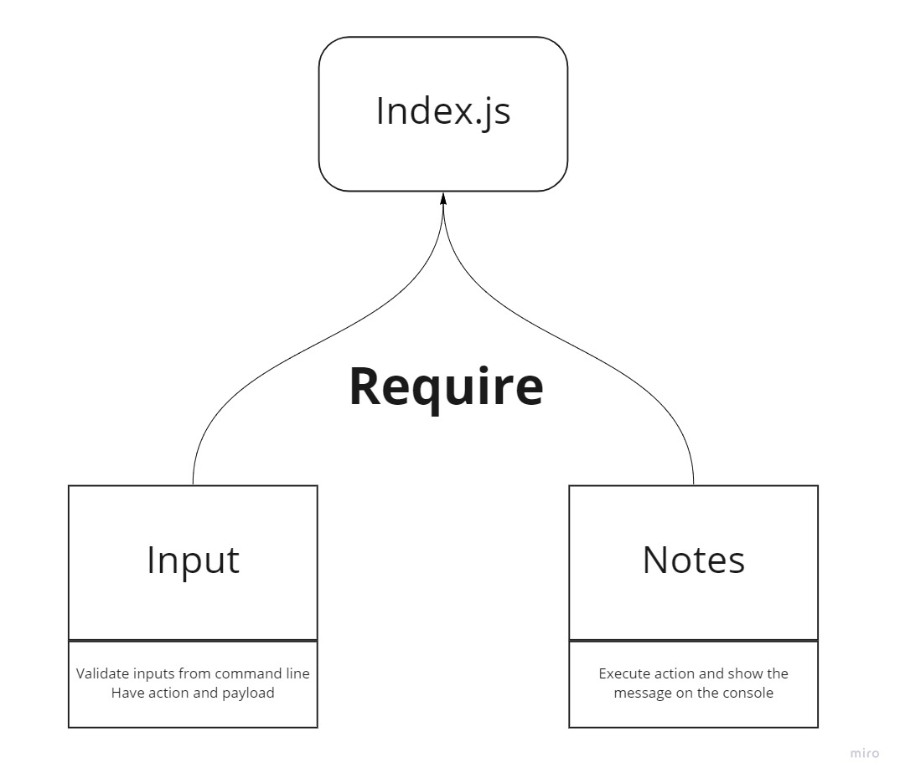

# LAB - Class 01

## Project: Notesy
A terminal based (CLI) application allowing users to easily create and manage a list of categorized notes

### Author: Abdulhakim Zatar

### Links and Resources

- [ci/cd](https://github.com/zatar-401-advanced-javascript/notes/actions/new) (GitHub Actions)

### Setup

#### How to initialize/run your application (where applicable)

- e.g. `node index.js --add "This is a really cool thing that I wanted to remember for later"`

#### How to use your library (where applicable)

#### Tests
Lint Tests: `npm run lint`

#### UML

